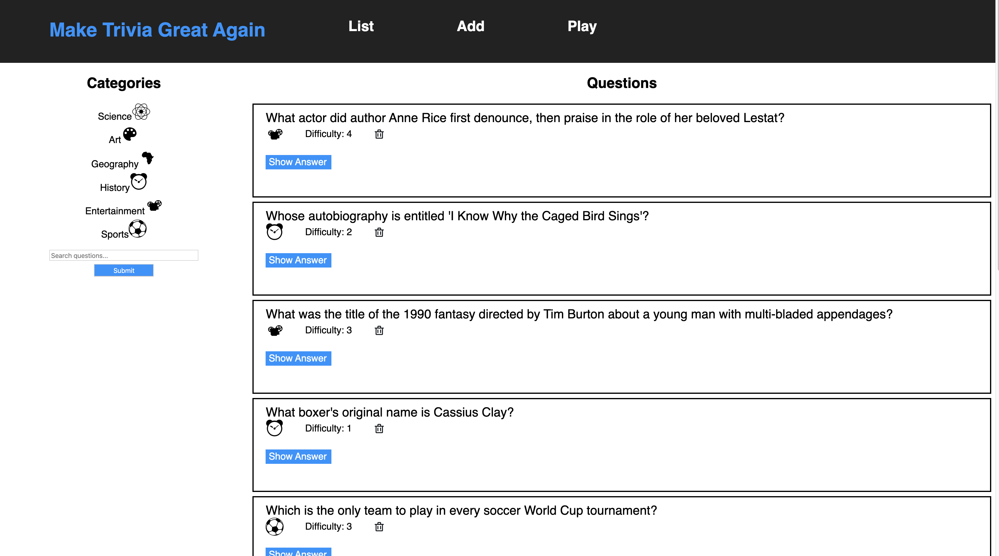
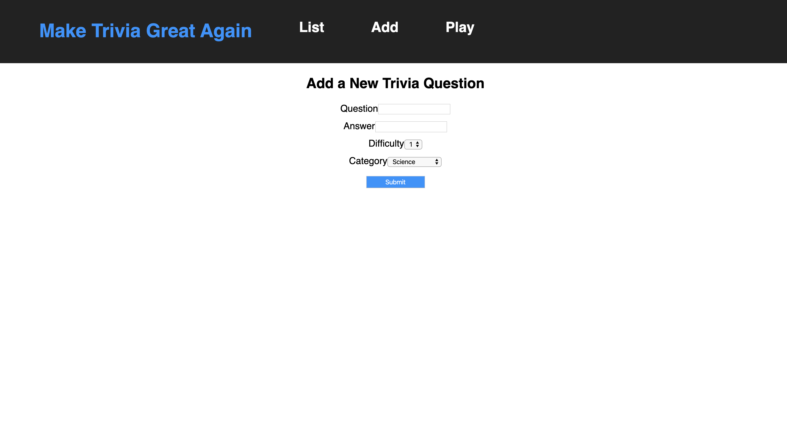

## Full Stack Trivia

Full stack trivia app, with focus on its back end, App has all the CRUD functionality.Its based on restful routing principles . CORS is enabled on the backend. 

### Tech Stack

* **Python3** and **Flask** 
* **SQLAlchemy ORM** 
* **PostgreSQL** 
* **Flask-Migrate** 
**React** and **Javascript** 
* **Unittest** [For testing on server]

home page

form to add new questions.

